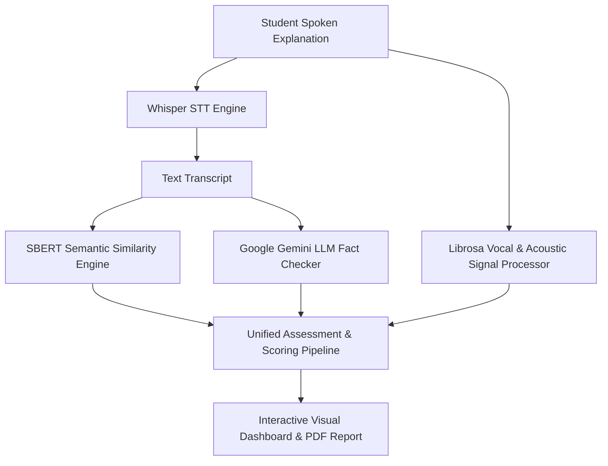

# 💡 Project Idea & Core Value Proposition

## 🚀 Project Title
**Voice-Based Concept Understanding Analyser (VBCUA)**

## 🌟 The Core Concept
The Voice-Based Concept Understanding Analyser provides an AI-driven, objective, and scalable framework for oral concept assessment. Instead of relying on rigid keyword matching, VBCUA measures deep semantic alignment between a user's spoken explanation and target domain concepts while evaluating verbal delivery metrics (fluency, filler words, and pauses).

## 🔑 Key Novelties & Advantages
1. **Multi-Dimensional Evaluation**: Evaluates *what* was said (semantic similarity + fact-checking) alongside *how* it was said (vocal clarity + filler word count).
2. **LLM-Enhanced Feedback**: Provides actionable improvement tips using Google Gemini API instead of raw numerical scores alone.
3. **Automated Report Generation**: Instantly produces structured PDF reports ready for student archiving and instructor review.
4. **Dual Frontend Interfaces**: Offers both a modern React + Vite dashboard and a lightweight Python Streamlit web app.
