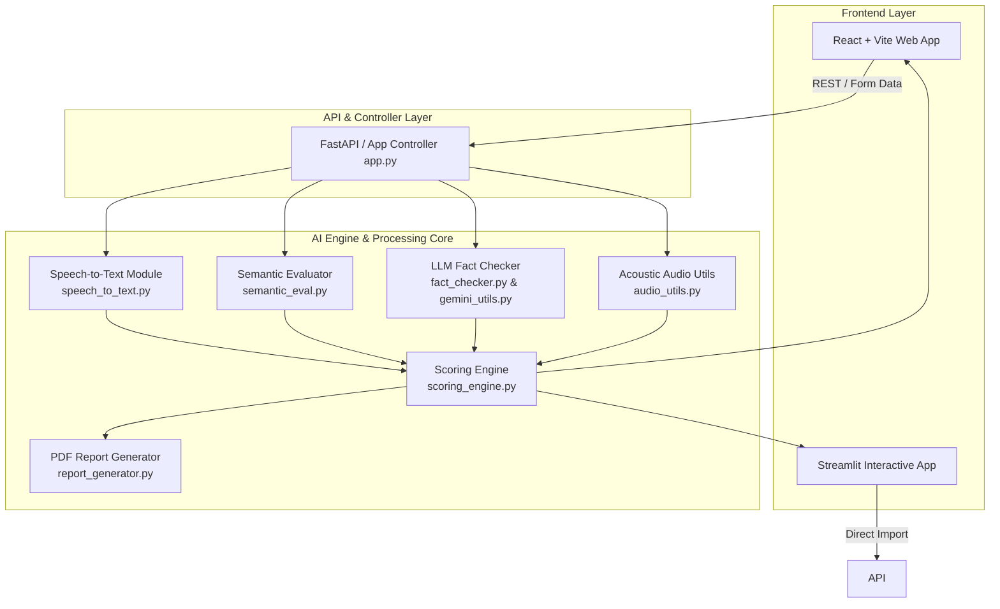
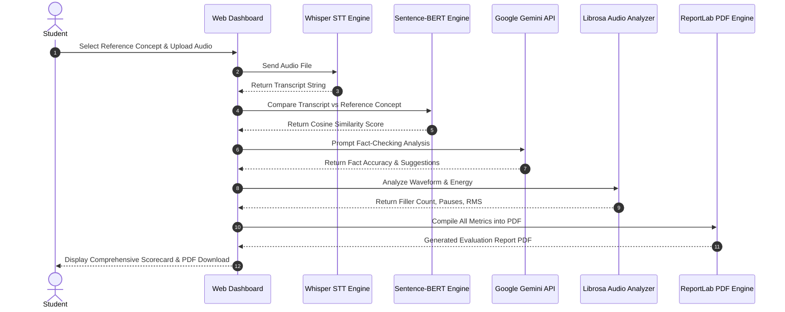
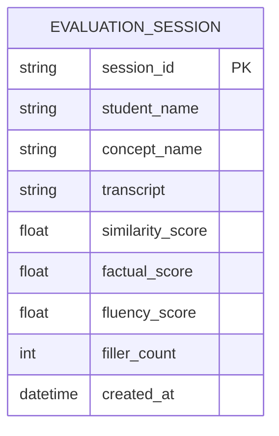

# 📐 Phase 3: Project Design & System Architecture

## 🏗️ System Architecture Overview
The Voice-Based Concept Understanding Analyser (VBCUA) utilizes a modular microservices-oriented application architecture separating audio signal intake, transcription, semantic embedding calculation, generative LLM reasoning, scoring aggregation, and frontend presentation.

---

## 🔁 Sequence Diagram: Evaluation Flow

---

## 🗄️ Database & Schema Design

| Table / Entity | Field | Type | Description |
| :--- | :--- | :--- | :--- |
| `EvaluationSession` | `session_id` | `UUID` | Primary Key |
| | `student_name` | `VARCHAR(100)` | Name of student |
| | `concept_name` | `VARCHAR(200)` | Evaluated concept title |
| | `transcript` | `TEXT` | Generated speech transcript |
| | `similarity_score` | `FLOAT` | Cosine similarity score (0-1) |
| | `factual_score` | `FLOAT` | LLM factual accuracy score |
| | `fluency_score` | `FLOAT` | Acoustic fluency rating |
| | `filler_count` | `INTEGER` | Detected filler word count |
| | `created_at` | `TIMESTAMP` | Timestamp of evaluation |

