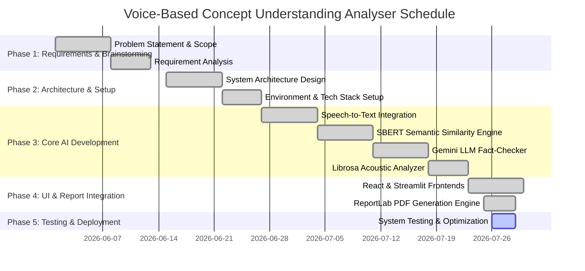

# 📅 Phase 4: Project Planning & Work Breakdown Structure

## 📌 Development Roadmap

---

## 🧱 Work Breakdown Structure (WBS)

### 1. Project Management & Design
- WBS 1.1 Requirements Specification & Feature Matrix
- WBS 1.2 Architecture Diagrams & Flowcharts
- WBS 1.3 Repository Structure Standardization

### 2. Core AI & Analytics Modules
- WBS 2.1 Audio Preprocessing & Noise Reduction (`audio_utils.py`)
- WBS 2.2 Speech-to-Text Transcription (`speech_to_text.py`)
- WBS 2.3 Sentence-BERT Semantic Matching Engine (`semantic_eval.py`)
- WBS 2.4 Google Gemini LLM Integration (`gemini_utils.py` & `fact_checker.py`)
- WBS 2.5 Multi-Metric Scoring Engine (`scoring_engine.py`)

### 3. Application & User Interface
- WBS 3.1 Python Streamlit App (`app.py` & `landing_page.py`)
- WBS 3.2 React + Vite Frontend Application (`frontend/src/`)
- WBS 3.3 Dynamic PDF Evaluation Report Generator (`report_generator.py`)

### 4. Quality Assurance & Documentation
- WBS 4.1 Automated Unit Tests Execution
- WBS 4.2 Security & API Key Masking Verification
- WBS 4.3 Documentation & Demo Preparation
