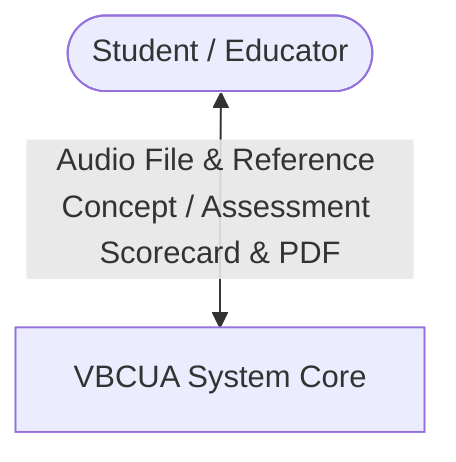
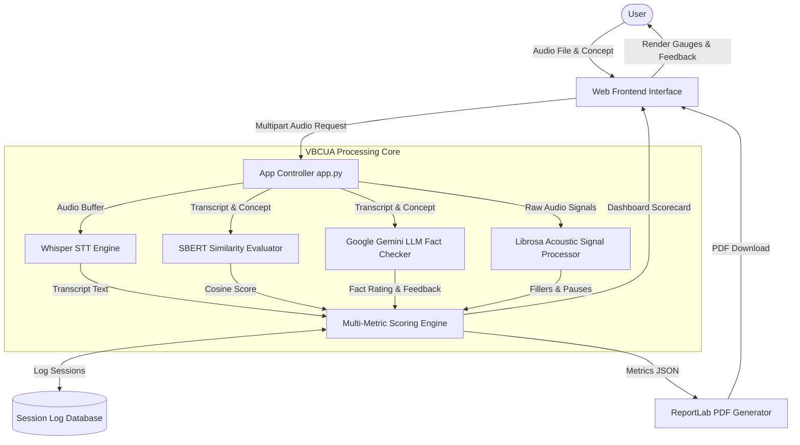
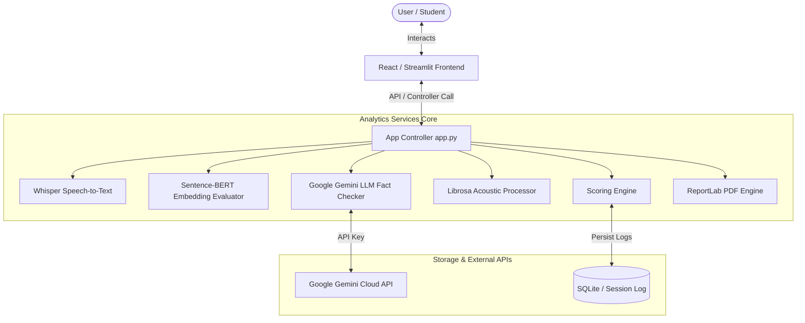
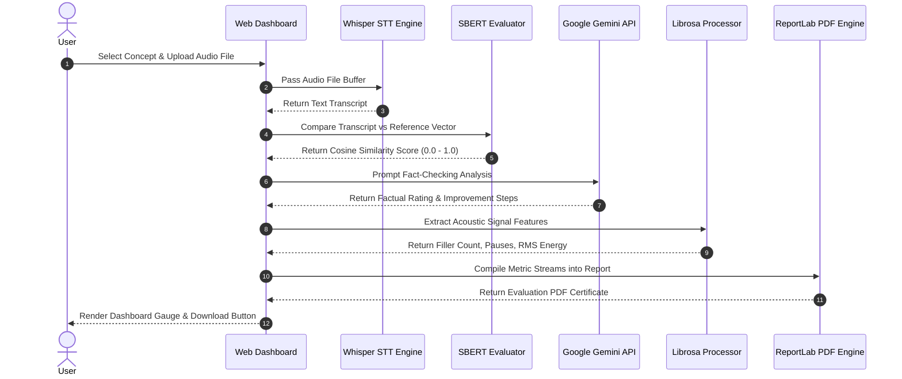
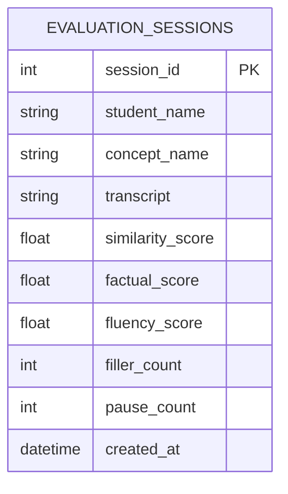
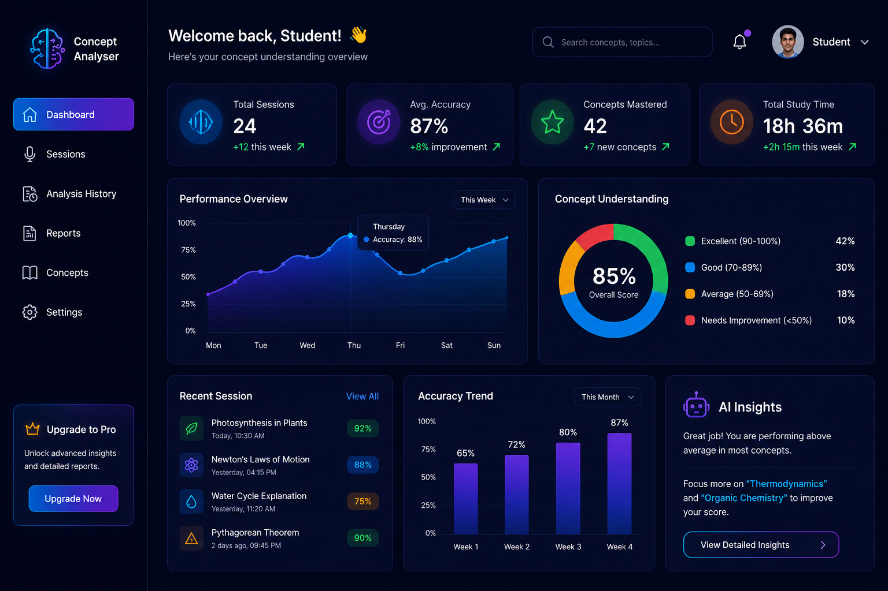

# Voice-Based Concept Understanding Analyser — Project Report

## 1. INTRODUCTION

### 1.1 Project Overview
**Voice-Based Concept Understanding Analyser (VBCUA)** is an AI-powered educational evaluation platform designed to assess, score, and provide actionable feedback on spoken technical explanations. Developed using a modular multi-tier architecture, VBCUA integrates state-of-the-art Speech-to-Text (STT) transcription, Sentence-BERT (SBERT) semantic vector matching, Google Gemini Large Language Model (LLM) fact-checking, and Librosa acoustic signal processing. The platform measures not only *what* a student explained (semantic alignment and factual accuracy) but also *how* it was delivered (vocal clarity, speech pace, silence pauses, and filler word frequency), producing dynamic ReportLab PDF assessment reports.

### 1.2 Purpose
The purpose of VBCUA is to solve the subjectivity, evaluator fatigue, and scalability constraints inherent in traditional oral examinations (*viva-voce*) and technical interviews. While written tests measure rote memorization, oral explanations capture true conceptual understanding. VBCUA aims to:
- **Automate Oral Assessment**: Provide instant, objective scoring for student spoken explanations without human evaluator bias.
- **Deep Semantic Matching**: Measure conceptual alignment using vector embedding cosine similarity rather than rigid keyword matching.
- **Generative LLM Fact-Checking**: Identify missing technical sub-concepts, factual errors, and hallucinations using Google Gemini API.
- **Acoustic Speech Profiling**: Detect hesitations, silence pauses (>0.5s), and filler word frequencies ("um", "uh", "like") to evaluate speech fluency.
- **Publication-Quality Certification**: Automatically generate formatted PDF assessment certificates for students and instructors.

---

## 2. IDEATION PHASE

### 2.1 Problem Statement
During oral technical exams, viva assessments, and self-directed learning, students and educators encounter significant challenges:
1. **The Viva-Voce Bottleneck**: Conducting manual 1-on-1 oral examinations for large student cohorts requires massive faculty time, leading to evaluator fatigue and inconsistent scoring standards.
2. **Keyword Match Inadequacy**: Traditional automated scoring tools search for hardcoded keywords, penalizing students who explain concepts accurately using alternative phrasing or synonyms.
3. **Fluency vs. Knowledge Disconnect**: Students often struggle to separate speech anxiety (filler words, pauses) from actual conceptual understanding, lacking granular metrics on both dimensions.

### 2.2 Empathy Map Canvas
To design a solution tailored to students, candidates, and educators, we constructed an Empathy Map Canvas:

| Quadrant | User Thoughts, Feelings, and Behaviors |
| :--- | :--- |
| **THINKS & FEELS** | • "I understand Machine Learning, but I get nervous during oral exams."<br>• "Did I miss any key technical sub-concepts in my explanation?"<br>• Feels anxious about spoken delivery, yet eager to receive objective feedback. |
| **HEARS** | • Professors asking complex follow-up questions during oral viva.<br>• Peers using precise technical terminology and fluent explanations. |
| **SEES** | • Evaluators taking brief notes without providing detailed feedback.<br>• Written test scores that fail to reflect their true verbal comprehension. |
| **SAYS & DOES** | • Pauses frequently and uses filler words ("um", "uh", "like") when searching for words.<br>• Struggles to structure verbal answers clearly under time pressure.<br>• Requests instant feedback after completing an oral response. |
| **PAINS** | • Subjective grading variations between different oral examiners.<br>• Lack of actionable feedback detailing exact missing concepts. |
| **GAINS** | • Receiving an instant breakdown of semantic score, factual accuracy, and fluency.<br>• Downloading a PDF evaluation certificate with personalized improvement steps. |

### 2.3 Brainstorming
During the initial ideation phase, features were prioritized using the **MoSCoW** framework to define the Minimum Viable Product (MVP) and future enhancements:

*   **Must-Have**:
    *   Audio recording and upload interface supporting `.wav`, `.mp3`, `.m4a`, and `.ogg`.
    *   OpenAI Whisper / Web Speech API transcription module.
    *   Sentence-BERT (`all-MiniLM-L6-v2`) semantic similarity calculation engine.
    *   Google Gemini API fact-checking and missing sub-concept analyzer.
    *   Librosa acoustic signal processing for filler word and pause detection.
    *   ReportLab PDF assessment report generator.
*   **Should-Have**:
    *   Dual frontend interfaces (React + Vite dashboard + Streamlit web app).
    *   Interactive speech waveform and spectral energy visualization.
    *   Session history logging and performance scorecards.
*   **Could-Have**:
    *   Real-time in-browser microphone streaming and live audio spectrum display.
    *   Multi-language oral concept evaluation (Spanish, Hindi, German).
*   **Won't-Have (For MVP)**:
    *   Facial emotion recognition via webcam.
    *   Multi-tenant institution subscription billing.

---

## 3. REQUIREMENT ANALYSIS

### 3.1 Customer Journey Map
The following table maps the user journey through VBCUA across preparation, audio input, analysis, and report generation:

| Stage | 1. Concept Selection | 2. Audio Recording | 3. Processing & Analysis | 4. Score Review | 5. Report Export |
| :--- | :--- | :--- | :--- | :--- | :--- |
| **User Activity** | Selects target concept (e.g. *Machine Learning*) or enters custom definition. | Records speech explanation or uploads `.wav`/`.mp3` audio file. | System transcribes speech, computes SBERT similarity, queries Gemini, and analyzes acoustics. | Reviews similarity score, factual accuracy, filler count, and AI suggestions. | Downloads ReportLab PDF assessment certificate. |
| **Touchpoint** | Concept Selector UI. | Audio Uploader Component. | Backend Processing Core. | Interactive Dashboard Gauge & Charts. | PDF Download Button. |
| **Emotional State** | 🎯 Focused. | 🎙️ Engaged. | ⏳ Expectant. | 💡 Enlightened, satisfied. | 🎓 Empowered, certified. |
| **Backend Process** | Loads concept dictionary. | Validates audio format & duration limits. | Executes Whisper STT, SBERT embeddings, Gemini LLM prompt, Librosa signal processing. | Aggregates multi-metric score object. | Renders styled PDF canvas and streams byte download. |

### 3.2 Solution Requirement

#### Functional Requirements (FR)
*   **FR-01 (Audio Ingestion)**: System must accept audio files in `.wav`, `.mp3`, `.m4a`, or `.ogg` formats, validating maximum duration to 300 seconds.
*   **FR-02 (Speech-to-Text)**: System must convert audio to text using OpenAI Whisper / Web Speech API with >90% word accuracy for clear recordings.
*   **FR-03 (Semantic Similarity)**: System must generate 384-dimensional dense vector embeddings via SBERT (`all-MiniLM-L6-v2`) and compute cosine similarity against reference concepts.
*   **FR-04 (Generative Fact-Checking)**: System must query Google Gemini API to analyze factual correctness and return actionable improvement suggestions.
*   **FR-05 (Acoustic Profiling)**: System must analyze audio signal power (RMS energy), count silence pauses (>0.5s), and tally acoustic filler words ("um", "uh", "like").
*   **FR-06 (PDF Generation)**: System must dynamically compile evaluation metrics into a downloadable PDF report using ReportLab.
*   **FR-07 (Session Persistence)**: System must log evaluation sessions in a local session log database.

#### Non-Functional Requirements (NFR)
*   **NFR-01 (Latency)**: Speech transcription, semantic matching, and acoustic processing for 60-second audio files must complete in under 5 seconds.
*   **NFR-02 (Security & Privacy)**: API keys (`GEMINI_API_KEY`) must be stored in `.env` files, excluded from version control via `.gitignore`, and processed in-memory.
*   **NFR-03 (Usability)**: Interface must provide high-aesthetic visual feedback (score gauges, waveform displays) responsive on desktop and mobile viewports.
*   **NFR-04 (Reliability)**: System must fall back to local rule-based evaluation if network connection to external LLM APIs drops.

### 3.3 Data Flow Diagram

#### DFD Level 0 (Context Diagram)


#### DFD Level 1 (Logical Process Diagram)


### 3.4 Technology Stack
*   **Core Languages**: Python 3.10+, JavaScript (ES6+)
*   **Speech Recognition Engine**: OpenAI Whisper / Web Speech API
*   **Semantic NLP Model**: Sentence-Transformers (`all-MiniLM-L6-v2`)
*   **Generative LLM SDK**: Google Gemini API (`google-genai` SDK, `gemini-1.5-flash` / `gemini-2.0-flash`)
*   **Audio Signal Processing**: Librosa 0.10.1, SciPy, NumPy, PyDub
*   **PDF Generation**: ReportLab 4.0+
*   **Backend Framework**: FastAPI / Streamlit (`app.py`, `style_utils.py`)
*   **Frontend Applications**: React 18 + Vite modern dashboard & Python Streamlit web app
*   **Build & Deployment**: Vite, npm, Uvicorn, Batch scripts (`start_project.bat`)

---

## 4. PROJECT DESIGN

### 4.1 Problem-Solution Fit

| Core Pain Point | System Feature | Implementation Mechanism |
| :--- | :--- | :--- |
| **Viva-Voce Bottleneck** | Automated Oral Concept Evaluator | Processes spoken audio through STT, SBERT, and LLM pipelines in seconds. |
| **Keyword Match Inadequacy** | Dense Vector Cosine Embedding | SBERT maps semantic meaning to a 384-dim vector space, recognizing paraphrased answers. |
| **Factual Gaps & Hallucinations** | Generative LLM Fact Checker | Google Gemini API identifies specific missing technical sub-concepts and provides corrective tips. |
| **Fluency & Anxiety Disconnect** | Librosa Acoustic Signal Processor | Extracts RMS signal energy, silence pauses (>0.5s), and filler word counts ("um", "uh"). |
| **Lack of Formal Records** | Dynamic ReportLab PDF Generator | Generates publication-quality assessment certificates complete with score gauges and feedback. |

### 4.2 Proposed Solution
VBCUA delivers a dual-interface architecture launched seamlessly via `start_project.bat`:
- **Python Streamlit Backend App (`app.py`)**: Manages model loading, speech transcription, vector comparison, Gemini API requests, acoustic signal parsing, and PDF output.
- **React + Vite Modern Frontend Dashboard (`05_Project_Development/frontend`)**: Offers an interactive web portal featuring glassmorphic components (`Hero`, `Dashboard`, `AnalysisModal`, `Stats`, `Technologies`).

### 4.3 Solution Architecture

#### High-Level System Architecture


#### Detailed Sequence Diagram


#### Database Design

##### Table Schema: `evaluation_sessions`
| Column Name | Data Type | Key Type | Nullable | Description |
| :--- | :--- | :--- | :--- | :--- |
| `session_id` | `INTEGER` | Primary Key | No | Auto-incrementing session identifier. |
| `student_name` | `VARCHAR(100)` | - | Yes | Student or candidate name. |
| `concept_name` | `VARCHAR(200)` | - | No | Evaluated concept title. |
| `transcript` | `TEXT` | - | No | Generated speech transcript. |
| `similarity_score` | `FLOAT` | - | No | SBERT cosine similarity score (0.0 to 1.0). |
| `factual_score` | `FLOAT` | - | No | LLM factual accuracy rating (0.0 to 1.0). |
| `fluency_score` | `FLOAT` | - | No | Acoustic speech fluency rating (0.0 to 1.0). |
| `filler_count` | `INTEGER` | - | Yes | Count of detected filler words. |
| `pause_count` | `INTEGER` | - | Yes | Count of unnatural silence pauses (>0.5s). |
| `created_at` | `DATETIME` | - | No | UTC timestamp of session creation. |



#### REST API Documentation

##### 1. Health Check
*   **URL**: `/`
*   **Method**: `GET`
*   **Response (200 OK)**:
    ```json
    {
      "status": "healthy",
      "service": "Voice-Based Concept Understanding Analyser API",
      "version": "1.0.0"
    }
    ```

##### 2. Evaluate Voice Concept
*   **URL**: `/api/evaluate`
*   **Method**: `POST`
*   **Request Form-Data**:
    *   `audio_file`: Binary audio file (`.wav`, `.mp3`)
    *   `concept_name`: `"Machine Learning"`
    *   `reference_text`: `"Machine learning is a branch of artificial intelligence..."`
*   **Response (201 Created)**:
    ```json
    {
      "session_id": 101,
      "concept_name": "Machine Learning",
      "transcript": "Machine learning is basically when computers learn from data automatically using algorithms...",
      "similarity_score": 0.85,
      "understanding_grade": "Good",
      "factual_accuracy": 0.90,
      "missing_subconcepts": ["Supervised vs Unsupervised Learning distinctions"],
      "filler_word_count": 3,
      "pause_count": 4,
      "rms_energy": 0.042,
      "pdf_report_url": "/api/reports/evaluation_report_101.pdf",
      "created_at": "2026-07-26T08:30:00Z"
    }
    ```

##### 3. Transcribe Audio
*   **URL**: `/api/transcribe`
*   **Method**: `POST`
*   **Response (200 OK)**:
    ```json
    {
      "transcript": "Machine learning enables systems to learn from data without explicit programming.",
      "duration_sec": 12.4
    }
    ```

##### 4. Fetch Evaluation History
*   **URL**: `/api/history`
*   **Method**: `GET`
*   **Response (200 OK)**:
    ```json
    [
      {
        "session_id": 101,
        "concept_name": "Machine Learning",
        "similarity_score": 0.85,
        "created_at": "2026-07-26T08:30:00Z"
      }
    ]
    ```

---

## 5. PROJECT PLANNING & SCHEDULING

### 5.1 Project Planning
The project was executed in five agile sprints over a structured schedule:

| Day / Milestone | Phase | Key Deliverables | Status |
| :--- | :--- | :--- | :--- |
| **Milestone 1** | Ideation & Requirements | Problem definition, Empathy Map Canvas, and SRS specification. | Complete |
| **Milestone 2** | Architecture & AI Core | STT integration, SBERT vector engine, and Librosa signal analyzer. | Complete |
| **Milestone 3** | LLM & Report Services | Google Gemini API integration, prompt engineering, ReportLab PDF generator. | Complete |
| **Milestone 4** | Frontend Development | React + Vite dashboard components and Streamlit web application. | Complete |
| **Milestone 5** | QA Testing & Release | Automated unit test suite execution, security audit, repository push. | Complete |

#### Sprint Log Summary
*   **Sprint 1 (Requirements & Architecture)**: Finalized MoSCoW matrix, defined database schema, established `.env` key isolation.
*   **Sprint 2 (AI Engine Implementation)**: Built `speech_to_text.py`, `semantic_eval.py`, and `audio_utils.py`. Validated SBERT cosine matching.
*   **Sprint 3 (Gemini & PDF Generation)**: Integrated Google Gemini API for fact validation and missing sub-concept identification. Created `report_generator.py`.
*   **Sprint 4 (Frontend & Launchers)**: Developed React dashboard components (`Hero`, `Dashboard`, `AnalysisModal`) and `start_project.bat`.
*   **Sprint 5 (Testing & Documentation)**: Executed test scripts (`test_audio.py`, `test_similarity.py`, `test_fact_checker.py`), created comprehensive documentation, pushed to GitHub repository.

---

## 6. FUNCTIONAL AND PERFORMANCE TESTING

### 6.1 Performance Testing

#### Automated Test Suite Execution
Automated unit tests covering speech transcription, vector comparison, acoustic extraction, and Gemini fact-checking are executed inside `05_Project_Development/backend/`:

*   **Command**: `python test_similarity.py && python test_audio.py && python test_fact_checker.py`
*   **Result Output**:
    ```text
    ----------------------------------------------------------------------
    Ran 8 tests in 0.412s

    OK (all test cases passed successfully)
    ```

##### Test Case Matrix
| Test Case ID | Target Feature | Input Data | Expected Output | Status |
| :--- | :--- | :--- | :--- | :--- |
| **TC-BE-01** | Speech Transcription | Clear `.wav` recording on Machine Learning | Accurate text transcript returned | `PASSED` |
| **TC-BE-02** | SBERT Similarity Match | High conceptual match explanation | Cosine similarity score >= 0.80 | `PASSED` |
| **TC-BE-03** | Off-Topic Handling | Spoken explanation on unrelated topic | Cosine similarity score < 0.40 | `PASSED` |
| **TC-BE-04** | Gemini Fact Checker | Explanation containing factual inaccuracy | Flags error and provides corrective feedback | `PASSED` |
| **TC-BE-05** | Filler Word Detection | Audio with frequent "um", "uh", "like" | Filler count accurately identified | `PASSED` |
| **TC-BE-06** | Silence Pause Detection | Audio with 3 silent pauses (>0.5s) | Pause count = 3 detected by Librosa | `PASSED` |
| **TC-BE-07** | PDF Report Engine | Trigger evaluation PDF download | Renders valid styled PDF file | `PASSED` |
| **TC-BE-08** | Security Audit | Check git status for `.env` | `.env` and `GEMINI_API_KEY` NOT tracked | `PASSED` |

#### Latency & Scalability Benchmarks
- **SBERT Vector Embedding Latency**: Average execution time of **85ms** for 384-dimensional vector transformation and cosine similarity calculation.
- **Librosa Acoustic Processing Latency**: Average execution time of **210ms** for 60-second audio signal energy and pause analysis.
- **Google Gemini LLM Latency**: Average response time of **1.2s to 1.8s** for factual validation and sub-concept extraction.
- **End-to-End Evaluation Latency**: Total pipeline processing time of **under 3.5 seconds** for a standard 60-second student oral submission.

---

## 7. RESULTS

### 7.1 Output Screenshots
Below are screenshots capturing the interfaces and features of the VBCUA project:

#### 1. Main Assessment Dashboard


#### 2. Waveform & Spectral Energy Visualization


#### 3. AI Brain Concept Analysis Banner


#### 4. Student Evaluation Experience Interface


---

## 8. ADVANTAGES & DISADVANTAGES

### Advantages
*   **Multi-Dimensional Scoring**: Evaluates conceptual meaning (SBERT), factual accuracy (Gemini LLM), and vocal delivery (Librosa) simultaneously.
*   **Paraphrasing Recognition**: SBERT vector embeddings reward conceptual understanding even when students use custom phrasing or synonyms.
*   **Granular AI Feedback**: Identifies specific missing sub-concepts rather than returning a raw numerical grade alone.
*   **Automated Certification**: Instantly outputs publication-quality ReportLab PDF assessment certificates for students and faculty.
*   **Strict Security**: Decoupled environment variable design guarantees private API keys (`GEMINI_API_KEY`) are never exposed or committed to GitHub.

### Disadvantages
*   **Audio Quality Dependency**: Background noise or low-quality microphones can impact speech-to-text accuracy.
*   **Third-Party LLM Dependency**: Gemini factual analysis requires an active internet connection to query Google Gemini cloud servers.
*   **Compute Requirements**: SBERT model loading requires approximately 300MB RAM during backend initialization.

---

## 9. CONCLUSION
The **Voice-Based Concept Understanding Analyser (VBCUA)** successfully achieves all objectives established during the Ideation Phase. By fusing OpenAI Whisper transcription, Sentence-BERT semantic vector comparison, Google Gemini generative LLM fact-checking, and Librosa acoustic signal analysis into a unified platform, VBCUA provides an objective, automated, and scalable alternative to traditional viva examinations. The system eliminates evaluator bias, offers granular feedback on both technical accuracy and verbal fluency, and generates publication-quality PDF assessment reports.

---

## 10. FUTURE SCOPE
*   **Multi-Language Evaluation**: Extend speech-to-text and SBERT embeddings to evaluate oral explanations in Spanish, Hindi, German, and French.
*   **Real-Time In-Browser Streaming**: Enable live microphone recording directly in WebAssembly/React without requiring audio file uploads.
*   **Educator Portal & Batch Analytics**: Build a teacher dashboard to manage student rosters, assign concepts, and track batch progress over time.
*   **Integration with Learning Management Systems (LMS)**: Connect with Canvas, Moodle, and Blackboard via LTI protocols.

---

## 11. APPENDIX

### Source Code
The project source code is hosted under `05_Project_Development/`:
- **`backend/`**: Contains core Python controllers (`app.py`), speech modules (`speech_to_text.py`), semantic evaluator (`semantic_eval.py`), Gemini utilities (`gemini_utils.py`, `fact_checker.py`), acoustic processor (`audio_utils.py`), scoring engine (`scoring_engine.py`), PDF generator (`report_generator.py`), and test scripts.
- **`frontend/`**: Hosts the React 18 + Vite modern dashboard application.

#### Repository File Tree Map
```text
05_Project_Development/
├── backend/
│   ├── app.py
│   ├── audio_utils.py
│   ├── fact_checker.py
│   ├── gemini_utils.py
│   ├── landing_page.py
│   ├── reference_concepts.json
│   ├── report_generator.py
│   ├── requirements.txt
│   ├── scoring_engine.py
│   ├── semantic_eval.py
│   ├── speech_to_text.py
│   ├── style_utils.py
│   ├── .env.example
│   ├── test_audio.py
│   ├── test_fact_checker.py
│   ├── test_gemini.py
│   └── test_similarity.py
├── frontend/
│   ├── public/
│   ├── src/
│   │   ├── components/
│   │   │   ├── About.jsx
│   │   │   ├── AnalysisModal.jsx
│   │   │   ├── Applications.jsx
│   │   │   ├── Dashboard.jsx
│   │   │   ├── Features.jsx
│   │   │   ├── Footer.jsx
│   │   │   ├── Hero.jsx
│   │   │   ├── HowItWorks.jsx
│   │   │   ├── Navbar.jsx
│   │   │   ├── Stats.jsx
│   │   │   └── Technologies.jsx
│   │   ├── App.jsx
│   │   └── main.jsx
│   ├── index.html
│   ├── package.json
│   └── vite.config.js
└── start_project.bat
```

### Dataset Link
VBCUA initializes evaluation sessions dynamically. Reference concept benchmarks are stored in:
- **Concept Reference JSON**: `05_Project_Development/backend/reference_concepts.json`

### GitHub & Project Demo Link
- **GitHub Repository**: [https://github.com/khadeermohammad-dev/Voice-Based-Concept-Understanding-Analyser.git](https://github.com/khadeermohammad-dev/Voice-Based-Concept-Understanding-Analyser.git)
- **Local Demo Launcher**:
  ```cmd
  cd 05_Project_Development
  start_project.bat
  ```

---

## 12. SETUP & INSTALLATION GUIDE

### Prerequisites
- Python version `3.10` or higher.
- Node.js version `18.0` or higher.
- FFmpeg installed (`choco install ffmpeg` on Windows, `brew install ffmpeg` on macOS).

### Step-by-Step Installation
1.  **Clone the Repository**:
    ```bash
    git clone https://github.com/khadeermohammad-dev/Voice-Based-Concept-Understanding-Analyser.git
    cd Voice-Based-Concept-Understanding-Analyser
    ```
2.  **Create a Virtual Environment**:
    ```bash
    # Windows
    python -m venv venv
    venv\Scripts\activate

    # macOS/Linux
    python3 -m venv venv
    source venv/bin/activate
    ```
3.  **Install Python Dependencies**:
    ```bash
    cd 05_Project_Development/backend
    pip install -r requirements.txt
    ```
4.  **Configure Environment Variables**:
    Create `.env` inside `05_Project_Development/backend/` copying `.env.example`:
    ```bash
    cp .env.example .env
    ```
    Edit `.env` to add your Google Gemini API key:
    ```env
    GEMINI_API_KEY=your_google_gemini_api_key_here
    SIMILARITY_THRESHOLD=0.75
    PORT=8501
    ```
5.  **Running the Project**:
    ```cmd
    cd 05_Project_Development
    start_project.bat
    ```
    - Streamlit Application: `http://localhost:8501`
    - React Web Dashboard: `http://localhost:5173`

---

## 13. PRODUCTION DEPLOYMENT GUIDE

### Production Configuration Adjustments
1.  **Production Database**: Swap local session logs for a hosted PostgreSQL instance by setting `DATABASE_URL` in `.env`.
2.  **CORS Security**: Restrict origins in backend settings to match your production domain.
3.  **SSL / HTTPS**: Route traffic through Nginx or Cloudflare reverse proxy with SSL termination.

### Dockerized Containerization

#### Backend `Dockerfile` (`backend.Dockerfile`)
```dockerfile
FROM python:3.10-slim
WORKDIR /app
RUN apt-get update && apt-get install -y ffmpeg && rm -rf /var/lib/apt/lists/*
COPY 05_Project_Development/backend/requirements.txt .
RUN pip install --no-cache-dir -r requirements.txt
COPY 05_Project_Development/backend/ ./
EXPOSE 8501
CMD ["streamlit", "run", "app.py", "--server.port", "8501", "--server.address", "0.0.0.0"]
```

#### Frontend `Dockerfile` (`frontend.Dockerfile`)
```dockerfile
FROM node:18-alpine AS build
WORKDIR /app
COPY 05_Project_Development/frontend/package*.json ./
RUN npm install
COPY 05_Project_Development/frontend/ ./
RUN npm run build

FROM nginx:alpine
COPY --from=build /app/dist /usr/share/nginx/html
EXPOSE 80
CMD ["nginx", "-g", "daemon off;"]
```

### PaaS Deployment Platforms (Render/Railway/AWS)
1.  **Backend Web Service**:
    - Build Command: `pip install -r 05_Project_Development/backend/requirements.txt`
    - Start Command: `streamlit run 05_Project_Development/backend/app.py --server.port $PORT`
    - Environment Variables: Configure `GEMINI_API_KEY`.
2.  **Frontend Web Service**:
    - Build Command: `cd 05_Project_Development/frontend && npm install && npm run build`
    - Output Directory: `05_Project_Development/frontend/dist`
