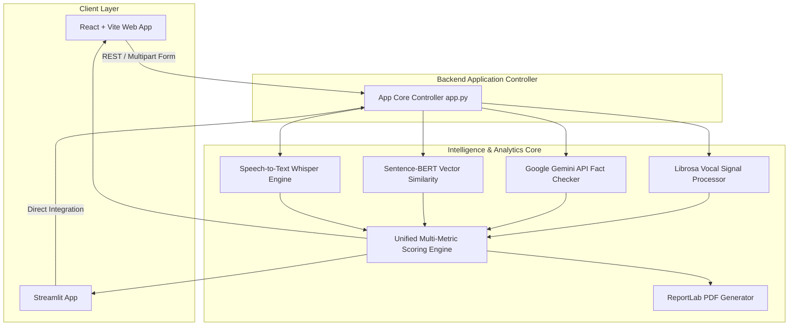
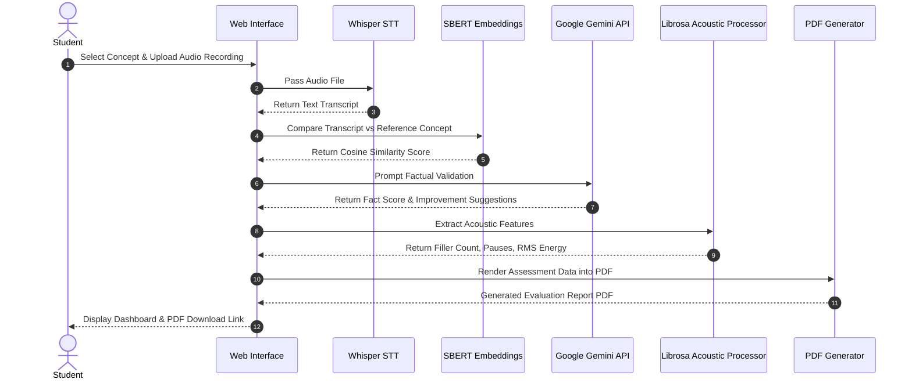
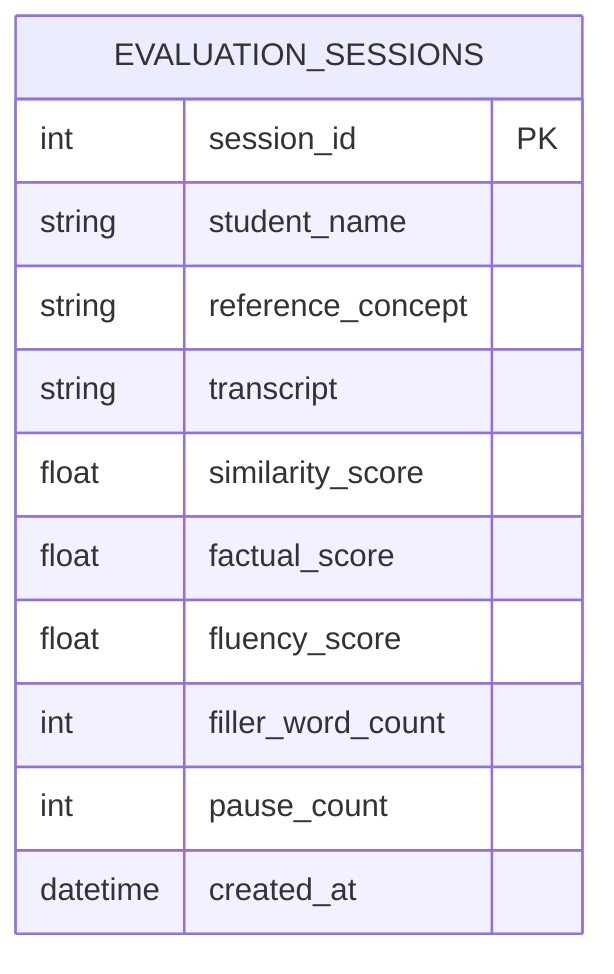

<div align="center">

# 🎙️ Voice-Based Concept Understanding Analyser (VBCUA)

[](https://www.python.org/)
[](https://react.dev/)
[](https://streamlit.io/)
[](https://ai.google.dev/)
[](https://www.sbert.net/)
[](LICENSE)

*An AI-powered, multi-dimensional evaluation platform for assessing oral technical explanations using Speech Recognition, Sentence Embeddings, Generative LLM Fact-Checking, and Vocal Signal Processing.*

---

[Key Features](#-key-features) •
[System Architecture](#%EF%B8%8F-system-architecture) •
[Installation & Quick Start](#-installation--quick-start) •
[Directory Structure](#-repository-structure) •
[Screenshots](#-screenshots--user-interface) •
[Testing](#-testing-suite) •
[License](#-license)

</div>

---

## 📖 Executive Overview

Traditional student evaluation relies heavily on written exams, which frequently fail to capture verbal articulation, conceptual depth, and real-time explanation clarity. Oral assessments (*viva-voce*) solve this but suffer from evaluator fatigue, subjectivity, and lack of scalability.

**Voice-Based Concept Understanding Analyser (VBCUA)** automates oral concept evaluation by combining state-of-the-art NLP, generative AI, and acoustic signal processing into a unified evaluation pipeline:

1. **Speech Transcription**: Converts student audio into accurate text using OpenAI Whisper.
2. **Semantic Similarity Vector Matching**: Computes cosine similarity between student transcripts and reference concept definitions using Sentence-BERT (`all-MiniLM-L6-v2`).
3. **LLM Fact Validation**: Evaluates factual accuracy, detects missing sub-concepts, and provides natural-language suggestions via Google Gemini API.
4. **Vocal & Acoustic Analytics**: Measures speech fluency, RMS audio energy, unnatural pauses, and filler word frequency ("um", "uh", "like") via Librosa.
5. **Dynamic PDF Report Export**: Compiles scores and visual charts into downloadable PDF assessment certificates powered by ReportLab.

---

## ✨ Key Features

- **🎙️ Speech-to-Text Processing**: Supports `.wav`, `.mp3`, `.m4a`, and `.ogg` formats with OpenAI Whisper model integration.
- **🧠 Semantic Vector Matching**: Deep sentence embedding comparison beyond surface-level keyword lookup.
- **⚡ Google Gemini AI Reasoning**: Generative factual analysis flagging missing technical sub-concepts.
- **📊 Vocal Fluency Metrics**: Detects hesitations, silence pauses (>0.5s), and filler word usage.
- **📄 ReportLab PDF Export**: Instant generation of structured PDF assessment reports with scorecards.
- **💻 Dual Frontend Support**: Modern React + Vite web dashboard alongside a lightweight Python Streamlit app.

---

## 🏗️ System Architecture



---

## 🔁 Sequence & Data Flow



---

## 🗄️ Database & Entity Relationship Diagram



---

## 📁 Repository Structure

```
.
├── .github/
│   ├── ISSUE_TEMPLATE/
│   │   ├── bug_report.md
│   │   └── feature_request.md
│   └── workflows/
│       └── python-app.yml
├── 01_Brainstorming/
│   ├── Brainstorming.md
│   └── Idea.md
├── 02_Requirement_Analysis/
│   └── Requirements.md
├── 03_Project_Design/
│   └── Design.md
├── 04_Project_Planning/
│   └── Planning.md
├── 05_Project_Development/
│   ├── backend/
│   │   ├── app.py
│   │   ├── audio_utils.py
│   │   ├── fact_checker.py
│   │   ├── gemini_utils.py
│   │   ├── landing_page.py
│   │   ├── reference_concepts.json
│   │   ├── report_generator.py
│   │   ├── requirements.txt
│   │   ├── scoring_engine.py
│   │   ├── semantic_eval.py
│   │   ├── speech_to_text.py
│   │   ├── style_utils.py
│   │   ├── .env.example
│   │   ├── test_audio.py
│   │   ├── test_fact_checker.py
│   │   ├── test_gemini.py
│   │   ├── test_similarity.py
│   │   ├── waveform/
│   │   └── website/
│   ├── frontend/
│   │   ├── public/
│   │   ├── src/
│   │   ├── index.html
│   │   ├── package.json
│   │   └── vite.config.js
│   └── start_project.bat
├── 06_Project_Testing/
│   └── Testing.md
├── 07_Project_Documentation/
│   └── Project_Report.md
├── 08_Project_Demonstration/
│   └── Demonstration.md
├── Screenshots/
│   ├── README.md
│   └── [UI Screenshots & Diagrams]
├── video_demo/
│   └── README.md
├── .env.example
├── .gitignore
├── CHANGELOG.md
├── CODE_OF_CONDUCT.md
├── CONTRIBUTING.md
├── LICENSE
└── README.md
```

---

## 🚀 Installation & Quick Start

### Prerequisites
- **Python**: Version 3.10 or higher
- **Node.js**: Version 18.0 or higher
- **FFmpeg**: Required for audio processing (`choco install ffmpeg` on Windows, `brew install ffmpeg` on macOS)

### 1. Clone the Repository
```bash
git clone <your_repository_url>
cd main-sub-project
```

### 2. Configure Environment Variables
Copy `.env.example` to `.env` inside `05_Project_Development/backend/`:
```bash
cp .env.example 05_Project_Development/backend/.env
```
Open `05_Project_Development/backend/.env` and add your Google Gemini API key:
```env
GEMINI_API_KEY=AIzaSyYourActualGeminiKeyHere
SIMILARITY_THRESHOLD=0.75
PORT=8501
```

### 3. Quick Run via Batch Script (Windows)
```cmd
cd 05_Project_Development
start_project.bat
```

### 4. Manual Setup & Run

#### Backend Setup:
```bash
cd 05_Project_Development/backend
python -m venv venv

# Windows Activation:
venv\Scripts\activate
# macOS/Linux Activation:
source venv/bin/activate

pip install -r requirements.txt
streamlit run app.py
```
*Access Streamlit app at:* `http://localhost:8501`

#### Frontend Setup:
```bash
cd 05_Project_Development/frontend
npm install
npm run dev
```
*Access React app at:* `http://localhost:5173`

---

## 📸 Screenshots & User Interface

### Main Dashboard Interface


### Waveform Signal Analytics


### AI Brain Concept Analysis Banner


---

## 🧪 Testing Suite

Automated backend unit tests verify audio processing, similarity algorithms, and API connections:

```bash
cd 05_Project_Development/backend
python test_audio.py
python test_similarity.py
python test_fact_checker.py
```

---

## 🔒 Security & Data Privacy

- **Sanitized Credentials**: `.env` files containing `GEMINI_API_KEY` are ignored in `.gitignore` and never committed to git repositories.
- **In-Memory Audio Processing**: Uploaded audio files are processed without long-term persistent storage.

---

## 📄 License

This project is licensed under the [MIT License](LICENSE).

---

## 🤝 Acknowledgements

- **OpenAI Whisper** for state-of-the-art speech transcription.
- **Sentence-Transformers (SBERT)** for semantic embeddings.
- **Google Gemini API** for generative factual validation.
- **Librosa** for audio signal processing.
- **ReportLab** for dynamic PDF generation.
